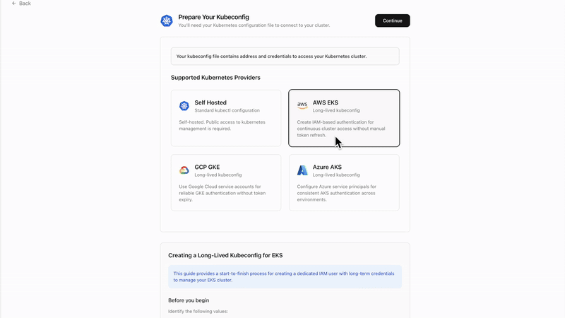

# Kubernetes Integration

Connect Calmo to your Kubernetes clusters to enable comprehensive container orchestration, monitoring, and troubleshooting through AI assistance. This integration provides access to 15+ specialized tools across 5 categories for complete cluster management.

## Overview & Value Proposition

The Kubernetes integration transforms how your team manages containerized applications by providing:

- **Cluster-Wide Visibility** - Monitor pods, services, deployments, and resources across namespaces
- **Intelligent Troubleshooting** - AI-powered analysis of pod failures, resource constraints, and configuration issues
- **Safe Operations** - Read-only tools enabled by default with granular control over write operations
- **Multi-Cloud Support** - Works with GKE, EKS, AKS, and self-managed clusters
- **Context-Aware Management** - Switch between clusters and namespaces seamlessly

## Key Capabilities

When connected, Calmo gains access to **15+ Kubernetes tools** across **5 categories**:

| Category | Tools | Capability |
|----------|-------|------------|
| **Resource Management** | 5 tools | Get, list, describe, apply, and create Kubernetes resources |
| **Operations** | 4 tools | View logs, scale deployments, patch resources, manage rollouts |
| **Cluster Management** | 3 tools | Switch contexts, list API resources, explain resource types |
| **Advanced Operations** | 3 tools | Port forwarding, resource deletion, generic kubectl commands |
| **Helm Operations** | 3 tools | Install, upgrade, and uninstall Helm charts |

## Prerequisites

- Kubernetes cluster access (GKE, EKS, AKS, or self-managed)
- Valid kubeconfig file with appropriate permissions
- For cloud providers: Service account keys (optional but recommended)
- Calmo account with team or personal workspace

## Setup Methods

### Method 1: Kubeconfig Upload (Recommended)

**Step 1: Prepare Your Kubeconfig**

1. Locate your kubeconfig file (typically `~/.kube/config`)
2. Ensure it contains valid cluster credentials and contexts
3. Verify access by running: `kubectl cluster-info`

**Step 2: Connect to Calmo**

1. Navigate to **Integrations** in your Calmo dashboard
2. Click **Kubernetes** integration
3. Choose **Upload Kubeconfig File**
4. Select your kubeconfig file or paste the contents
5. Select your desired **context** from available options
6. Choose target **namespace** (default: `default`)

### Method 2: Cloud Provider Service Account (Enhanced Security)

For enhanced security with cloud providers, you can supplement kubeconfig with service account keys:

#### Google Kubernetes Engine (GKE)

1. Create a service account in Google Cloud Console
2. Assign appropriate Kubernetes permissions
3. Download the service account key (JSON)
4. Upload both kubeconfig and service account key to Calmo

#### Amazon Elastic Kubernetes Service (EKS)

1. Configure AWS IAM role with EKS permissions
2. Update kubeconfig with AWS authentication
3. Provide AWS credentials through service account key

#### Azure Kubernetes Service (AKS)

1. Create Azure service principal
2. Assign Kubernetes permissions
3. Configure kubeconfig with Azure authentication

*Use Cases: Resource discovery, status checking, configuration analysis*

### ⚙️ Operations (Mixed Safety)
**Default: Logs only** - Operational tasks with varying risk levels

- **kubectl_logs** - View container logs (✅ Read-only)
- **kubectl_scale** - Scale deployments (⚠️ Write operation)
- **kubectl_patch** - Patch resource configurations (⚠️ Write operation)
- **kubectl_rollout** - Manage deployment rollouts (⚠️ Write operation)

*Use Cases: Debugging applications, scaling services, deployment management*

### 🗂️ Cluster Management (Read-Safe)
**Default: Enabled** - Essential cluster navigation

- **kubectl_context** - Switch between cluster contexts
- **list_api_resources** - Discover available Kubernetes APIs
- **explain_resource** - Get resource documentation and schemas

*Use Cases: Multi-cluster management, API discovery, resource understanding*

### 🔧 Advanced Operations (High Risk)
**Default: Disabled** - Powerful but potentially dangerous operations

- **port_forward** - Forward local ports to pods (⚠️ Network access)
- **kubectl_delete** - Delete Kubernetes resources (⚠️ Destructive)
- **kubectl_generic** - Execute arbitrary kubectl commands (⚠️ Unrestricted)

*Use Cases: Advanced debugging, direct cluster access, emergency operations*

### 📦 Helm Operations (Package Management)
**Default: Disabled** - Helm chart lifecycle management

- **install_helm_chart** - Install Helm charts (⚠️ Write operation)
- **upgrade_helm_chart** - Upgrade existing releases (⚠️ Write operation)  
- **uninstall_helm_chart** - Remove Helm releases (⚠️ Destructive)

*Use Cases: Application deployment, package management, release lifecycle*

## Team vs Personal Configuration

### Team/Organization Setup
- Shared cluster access across team members
- Centralized tool configuration and policies
- Organization-level context and namespace defaults
- Team administrators can manage tool permissions

### Personal Setup  
- Individual cluster connections
- Personal tool preferences and configurations
- Private contexts and namespace selections
- Full control over enabled capabilities

## Security & Best Practices

### ⚠️ Safety Recommendations

1. **Start with Read-Only** - Enable only read operations initially
2. **Gradual Enablement** - Add write operations as trust builds
3. **Namespace Isolation** - Restrict to specific namespaces when possible
4. **Regular Auditing** - Review enabled tools and permissions periodically
5. **Service Account Keys** - Use cloud provider service accounts for enhanced security

### 🔒 Permission Levels

| Risk Level | Operations | Recommendation |
|------------|------------|----------------|
| **Low** | Get, List, Describe, Logs | ✅ Safe to enable |
| **Medium** | Apply, Create, Scale, Patch | ⚠️ Enable with caution |
| **High** | Delete, Generic commands | ❌ Enable only when necessary |

## Configuration Management
## Configure Tool Access**

Review and customize tool categories based on your needs:

- ✅ **Resource Management** - Read operations (get, list, describe) enabled by default
- ❌ **Write Operations** - Apply, create, delete disabled by default for safety
- ✅ **Cluster Management** - Context switching and resource discovery enabled
- ❌ **Advanced Operations** - Port forwarding and generic commands disabled by default

## Tool Categories & Configuration

### 🔍 Resource Management (Read-Safe)
**Default: Enabled** - Essential for cluster visibility

- **kubectl_get** - Retrieve specific Kubernetes resources
- **kubectl_list** - List resources by type across namespaces  
- **kubectl_describe** - Get detailed resource information
- **kubectl_apply** - Apply configuration changes (⚠️ Write operation)
- **kubectl_create** - Create new resources (⚠️ Write operation)

### Updating Cluster Configuration

1. Navigate to **Integrations** → **Kubernetes**
2. Click **Edit Configuration**
3. Upload new kubeconfig or service account keys
4. Modify context and namespace selections
5. Adjust tool permissions as needed
6. Save changes

### Managing Multiple Clusters

- Not yet supported

## Troubleshooting

### Common Issues

**Connection Failed**
- Verify kubeconfig has valid credentials
- Check cluster connectivity: `kubectl cluster-info`
- Ensure proper context is selected

**Permission Denied**
- Verify service account has required Kubernetes permissions
- Check RBAC policies in your cluster
- Ensure namespace access is properly configured

**Tool Execution Errors**
- Review enabled tool permissions
- Check if operations require write access
- Verify cluster resources exist and are accessible

### Getting Help

1. **Reconnect Integration** - Use the reconnect option in integration settings
2. **Update Credentials** - Upload fresh kubeconfig or service account keys
3. **Contact Support** - Reach out to support@getcalmo.com for assistance

## Advanced Features

### Multi-Cloud Support
- **Google GKE** - Full integration with Google Cloud service accounts
- **Amazon EKS** - AWS IAM integration for enhanced security
- **Azure AKS** - Azure Active Directory integration
- **Self-Managed** - Support for any standard Kubernetes cluster

### Context & Namespace Management
- Switch between multiple cluster contexts
- Set default namespaces per context
- Maintain separate configurations per environment
- Support for namespace-scoped operations

The Kubernetes integration provides the most comprehensive container orchestration capabilities in Calmo, enabling your team to manage clusters efficiently through AI-powered assistance while maintaining strict security controls.

---

*For additional help with Kubernetes integration, contact our support team at support@getcalmo.com.* 